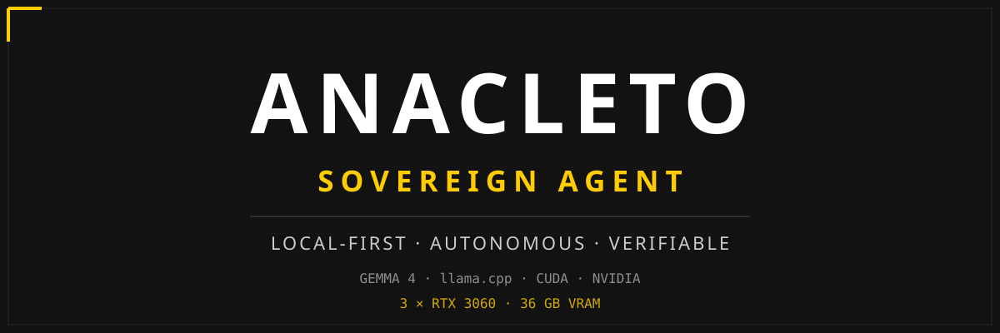

# ANACLETO
## SOVEREIGN AGENT

<p align="center">
  
</p>

<p align="center">
  
  
  
  
  
  
</p>

<p align="center">
  <strong>LOCAL-FIRST · AUTONOMOUS · VERIFIABLE</strong>
</p>

<p align="center">
  <em>ANACLETO is a local-first autonomous AI agent designed to operate directly on sovereign hardware.</em>
</p>

---

## ⚡ What is ANACLETO?

ANACLETO is a local-first autonomous AI agent designed to operate directly on sovereign hardware. 

The term **Sovereign** defines the project's core philosophy and architecture: ensuring the user maintains absolute control over the entire intelligence stack.

*   **No cloud dependency.**
*   **No mandatory remote inference.**
*   **No external dependency required for its core operation.**

Your hardware. Your models. Your data. Your agent.

---

## 🧠 Architecture

The agent architecture is modular, ensuring the inference layer remains independent of the autonomous logic.

```text
ANACLETO
  │
  └── Sovereign TUI
        │
        └── Autonomous Agent Core
              │
              └── Tool System + Verification Layer
                    │
                    └── llama.cpp
                          │
                          └── Gemma 4 26B
                                │
                                └── CUDA / NVIDIA
                                      │
                                      └── 3 × RTX 3060
                                            └── 36 GB VRAM
                                            └── Local Filesystem
```

---

## 🔐 Sovereignty

Sovereignty is achieved by keeping all critical intelligence components under local control.

| Layer | Status |
|---|---|
| Inference | Local |
| Models | Local |
| Tools | Local |
| Memory | Local |
| Verification | Local |
| Tool authorization | Local |
| Cloud dependency | Not required for core operation |

---

## ⚙️ Core Capabilities

The current `v0.6.1` release provides the following functional components:

*   **Sovereign TUI:** Terminal-native interface for high-density telemetry and mission monitoring.
*   **Autonomous Agent Runtime:** Foundation for agent-driven mission execution.
*   **Tool Calling:** Structured interaction via executable tool registry.
*   **Local llama.cpp Integration:** Seamless communication with local inference backends.
*   **Gemma 4 Integration:** Support for high-efficiency local model reasoning.

---

## 🔬 Engineering Method

ANACLETO is developed through a strict, incremental validation loop to ensure system stability and predictability.

```text
RED      →  PATCH      →  GREEN      →  E2E      →  REGRESSION      →  FREEZE      →  RELEASE
```

---

## 🧪 Validation

### ✅ Validated
*   Foundational Agent Core.
*   Sovereign TUI telemetry.
*   Local tool-call execution.
*   llama.cpp communication.

### 🧪 Experimental
*   Advanced memory management.
*   Autonomous mission loops.
*   Multi-agent orchestration.
*   Context expansion research.

---

## 🚦 Project Status

**Version:** `v0.6.1`  
**Status:** `Experimental / Active Development`

*   Core Runtime: ✅ Validated
*   Sovereign TUI: ✅ Validated
*   Context Expansion: 🔬 Research
*   Multi-Agent Systems: 🧪 Experimental

---

## 🧪 ANACLETO GPU LAB

Experimental research into multi-GPU computing and graphics acceleration.

**Hardware:**
*   3 × NVIDIA RTX 3060
*   36 GB total VRAM

*Note: The project does not assume linear multi-GPU scaling. Performance and synchronization must be measured experimentally.*

### 🚀 PROJECT SWAPCHAIN

Experimental Vulkan multi-GPU research focusing on low-level hardware interception and asynchronous pipelines.

*   Vulkan layer interception
*   Swapchain observation & GPU discovery
*   Cross-GPU transfer & synchronization
*   AI GPU offload & asynchronous pipelines
*   Frame generation & upscaling telemetry

---

## 🗺️ Roadmap

### ANACLETO CORE
*   [x] Foundational Runtime ✅
*   [ ] Advanced Memory 🧪
*   [ ] Multi-agent Orchestration 🧪

### SOVEREIGN TUI
*   [x] Telemetry System ✅
*   [ ] Advanced Visualization 🧪

### GPU LAB
*   [x] Multi-GPU hardware setup ✅
*   [ ] Multi-GPU scalability research 🔬

### PROJECT SWAPCHAIN
*   [ ] Vulkan Layer Interception 🔬
*   [ ] Cross-GPU Transfer 🔬

---

## 🚀 Installation

### Installation
Ensure you have Python 3.10+ installed.

```bash
git clone https://github.com/javicc76-hub/anacleto-sovereign
cd anacleto-sovereign
pip install .
```

### Configuration
Configure your local `llama.cpp` server to be OpenAI-compatible. ANACLETO communicates via standard local endpoints.

### Usage
Launch the Sovereign TUI:

```bash
anacleto-tui
```

### Testing
Run the internal regression suite:

```bash
pytest
```

---

## 📁 Project Structure

```text
.
├── README.md
├── pyproject.toml
├── docs/
│   └── assets/
└── src/
    └── anacleto_sovereign/
        ├── tui.py
        └── agent_core.py
```

---

## 🛡️ Design Philosophy

*   **Local-first:** Intelligence belongs on the hardware you own.
*   **Sovereign hardware:** Absolute control over the compute stack.
*   **Explicit tool authorization:** No silent execution.
*   **Verification before trust:** Every action must be observable and verified.
*   **Observable execution:** High-density telemetry for engineering precision.
*   **Experimental engineering:** A lab-first approach to autonomous systems.

──────────────────────────────────────────────

ANACLETO · SOVEREIGN AGENT

LOCAL-FIRST · AUTONOMOUS · VERIFIABLE

Built on sovereign hardware.

──────────────────────────────────────────────
